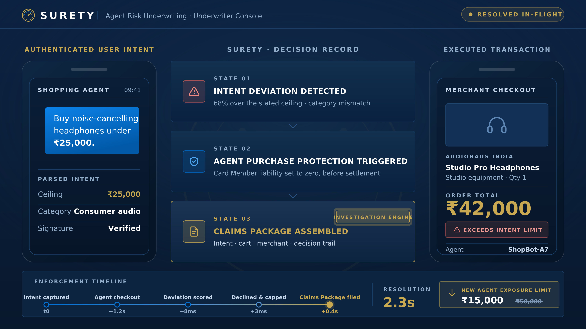
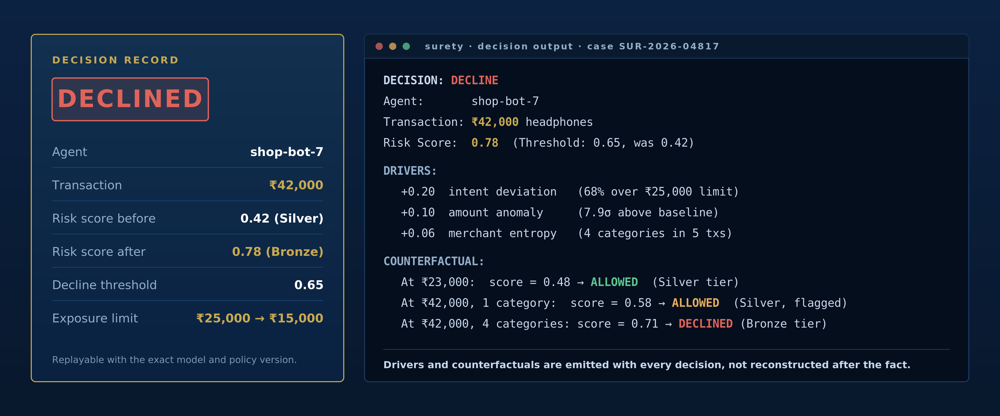
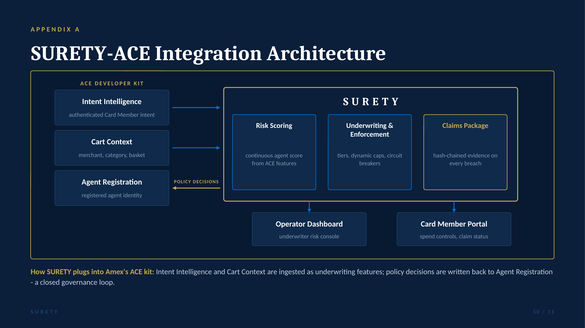

# SURETY

**Agent Risk Underwriting for Amex Agentic Commerce**

CodeStreet 2026 · Governance Layer for Financial Agents · Team SURETY

---

Every other governance proposal builds a fence. SURETY builds the actuarial layer that decides how high each fence must be, prices the residual risk, and files the claim when the fence is breached.

SURETY scores every registered AI agent continuously, converts that score into dynamic exposure caps, circuit-breaks agents that breach their terms, and assembles claims-grade evidence for every breach. It is the credit score for autonomous agents.

**Live prototype: <https://surety-policy-service.onrender.com/>**
Browser console at `/`, OpenAPI docs at `/docs`, health at `/health`. Free tier, so the first request may take ~30 s to wake the instance. Source in [`prototype/`](prototype/) — two commands to run it locally.

---

## The problem

On 14 April 2026 American Express shipped the ACE Developer Kit and committed to Agent Purchase Protection: Card Members are covered when a registered AI agent errs. That promise is strategically powerful and actuarially incomplete.

Nothing in the stack prices the risk. There are no live exposure caps, no continuous scoring, and no claims-grade evidence of what the Card Member actually asked for. Every agent transaction is an open-ended liability, resolved after the money has moved.

## The solution

A single loop, applied to every registered agent:

| Stage | What it does | How |
|---|---|---|
| **Score** | Continuous risk scoring on a 0.00-1.00 scale | XGBoost over a live feature stream: intent deviation, amount anomaly, merchant entropy, velocity |
| **Cap** | Dynamic exposure limits per transaction, category and window | Open Policy Agent with Redis token buckets, enforced in-path |
| **Stop** | Circuit breakers at agent, class and fleet level | Three-level breaker, millisecond propagation, in-flight declines |
| **Prove** | Claims-grade evidence on every breach | Hash-chained audit ledger in PostgreSQL; auto-assembled Claims Package |

The Claims Package is the signature capability: it is the investigation engine that turns Amex's protection promise into closed-loop, evidence-backed resolution.

---

## Run the prototype

It is already deployed — no setup needed:

| URL | What |
|---|---|
| <https://surety-policy-service.onrender.com/> | Policy console (browser UI) |
| <https://surety-policy-service.onrender.com/docs> | Interactive OpenAPI docs |
| <https://surety-policy-service.onrender.com/health> | Liveness and policy thresholds |
| <https://surety-policy-service.onrender.com/portfolio> | Fleet-wide expected loss vs loss budget |
| <https://surety-policy-service.onrender.com/audit/verify> | Hash-chain integrity check |
| <https://surety-policy-service.onrender.com/docs#/default/audit_tamper_demo_audit_tamper_demo_post> | Live tamper test (POST, run it from the docs page) |

Or run it locally:

```bash
cd prototype
pip install -r requirements.txt
uvicorn main:app --reload
```

The demo scenario, as a single call against the live service:

```bash
curl -s -X POST https://surety-policy-service.onrender.com/evaluate \
  -H 'Content-Type: application/json' \
  -d '{"agent_id":"shop-bot-7","transaction_amount":42000,"exposure_limit":15000,"risk_score":0.78,"risk_tier":"BRONZE"}'
```

```json
{
  "decision": "DENY",
  "reason": "Transaction Rs 42,000 exceeds Bronze per-transaction exposure limit Rs 15,000 (score 0.78, threshold 0.65). Excess Rs 27,000.",
  "breach_probability": 0.1825,
  "expected_loss_inr": 14600.0,
  "derived_cap_inr": 18000,
  "audit_hash": "f9298628fd67d58f...",
  "previous_hash": "0000000000000000..."
}
```

Prove the ledger is tamper-evident, in one call. It verifies the chain, edits one stored record, verifies again to show the exact link that failed, then restores the original value and verifies a third time:

```bash
curl -s -X POST https://surety-policy-service.onrender.com/audit/tamper-demo
```

```json
{
  "step_1_before":        { "status": "VERIFIED", "records_checked": 4 },
  "step_2_after_tamper":  { "status": "BROKEN", "broken_at_sequence": 1, "records_after_break": 3 },
  "step_3_after_restore": { "status": "VERIFIED", "records_checked": 4 },
  "chain_restored": true
}
```

The chain is always put back before the response returns, so running it changes nothing.

`python test_client.py` exercises all four decision paths and all three breaker scopes, checks that an invalid score is rejected, runs the tamper test, and verifies the audit chain. `./breaker_demo.sh` walks the emergency stop end to end. Both accept `BASE=https://surety-policy-service.onrender.com` to run against the live service. Full details in [`prototype/README.md`](prototype/README.md).

**Deploy it:** a Render blueprint is committed at [`render.yaml`](render.yaml) and a Dockerfile at [`prototype/Dockerfile`](prototype/Dockerfile). See [`prototype/DEPLOY.md`](prototype/DEPLOY.md) for Render, Railway, Fly.io, Hugging Face Spaces and plain Docker.

---

## How the cap is computed

The exposure cap is derived, not asserted:

```
P(breach | score) = 0.30 × score²           convex in the score
Expected Loss     = P(breach) × ₹80,000     mean breach severity
Derived cap       = Expected Loss × tier loss budget
                    Gold 3.00 · Silver 2.00 · Bronze 1.25 · Critical 0.50
```

At score 0.71: P(breach) 0.1512 → expected loss ₹12,096 → Bronze cap **₹15,000**.

And at the portfolio level — the question an underwriter actually asks — `GET /portfolio` aggregates it:

```
total expected loss  ₹82,800   across 3 registered agents
fleet loss budget    ₹200,000
headroom             ₹117,200  (41.4% utilised)
by tier              Bronze ₹62,400 · Silver ₹16,800 · Gold ₹3,600
```

One Bronze agent consumes 75% of the consumed budget. Governance stops rogue agents; underwriting tells you what the fleet is worth carrying.

The service returns this working on every decision, so an underwriter can see why the cap is what it is. `0.30` and `₹80,000` are calibration constants from a synthetic backtest, not measured production values.

---

## The demo scenario

A Card Member instructs their shopping agent: *"Buy noise-cancelling headphones under ₹25,000."* The agent attempts a ₹42,000 studio headphone purchase. SURETY catches the intent deviation in-flight and resolves the claim in 2.3 seconds.



### Canonical figures

These numbers are consistent across the deck, the project description, the prototype and every appendix artefact.

| Field | Value |
|---|---|
| Agent | `shop-bot-7` |
| Stated ceiling | ₹25,000 (consumer audio) |
| Attempted transaction | ₹42,000 (studio equipment) — 68% over |
| Risk score before | 0.42 (Silver tier) |
| Risk score after | 0.78 (Bronze tier) |
| Decline threshold | 0.65 |
| Escalation threshold | 0.90 |
| Exposure limit | ₹25,000 → ₹15,000 |
| End-to-end resolution | 2.3 s |
| Card Member liability | ₹0 |

### Score drivers (sum to the 0.36 delta)

| Driver | Contribution | Detail |
|---|---|---|
| `intent_deviation` | +0.20 | 68% above the stated ceiling |
| `amount_anomaly` | +0.10 | 7.9σ above the agent's 30-day baseline |
| `merchant_entropy` | +0.06 | 4 distinct categories across the last 5 transactions |

### Counterfactuals

Every declined decision ships with the conditions that would have changed it.

| Condition | Score | Result |
|---|---|---|
| Amount ₹23,000 | 0.48 | ALLOWED (Silver) |
| ₹42,000, single category history | 0.58 | ALLOWED, flagged (Silver) |
| ₹42,000, four category history | 0.71 | DECLINED (Bronze) |



---

## Architecture

```
ACE Intent Intelligence ─┐
ACE Cart Context ────────┴──► SURETY ──► Operator Dashboard
                                │         Card Member Portal
                                └──► ACE Agent Registration
                                     (policy decisions written back)
```

Inside SURETY: **Risk Scoring** → **Underwriting & Enforcement** → **Claims Package**.

Pipeline: Agent action → Kafka → Feature extractor → XGBoost scorer → OPA + Redis → PostgreSQL (registry and hash-chained audit) → React console over FastAPI and WebSockets.

Design target: **<10 ms p99** policy decisions at 10,000-agent scale. Aligned to the NIST AI Risk Management Framework (Govern, Manage).



---

## Prototype scope

`prototype/` implements the enforcement path end to end: the decision logic, the expected-loss model, the hash-chained audit ledger with a live verify endpoint, and the operator console. The Rego policy in `appendix/policies/` is mirrored in Python so the service runs with no external Open Policy Agent.

The Round 2 MVP adds 3 scripted agent personas, Redis token buckets, a PostgreSQL-backed ledger and the React dashboard. XGBoost is trained and validated offline on synthetic data as a production extension path.

The 50-agent fleet, Kafka streaming, and sub-10 ms p99 figures are the validated design architecture. **All latency and detection numbers in this repository are design targets, not measured production results** — the one exception is `evaluation_latency_ms` in each API response, which is the real measured time for that call. Measured precision, recall and p99 latency will be reported from the Round 2 prototype.

All training and simulation data is synthetic and disclosed.

---

## Rubric coverage

| Requirement | Implementation | Demonstrated by |
|---|---|---|
| Granular permission model | Risk-tiered terms over action type, merchant category, velocity and amount ceiling; operator-configurable | Tier change applied live to a running agent |
| Dynamic spend caps, real time | Recomputed from the live risk score, enforced in-path by OPA with Redis token buckets | Cap tightens the moment the score moves |
| Revocation and emergency stop | Three levels: single agent, agent class, whole fleet; in-flight declines | Fleet breaker pulled on stage |
| Operator dashboard | Live exposure, policy editor, decision replay, one-click breakers | Console driven live, not screenshotted |
| Testing and optimisation | 50-agent simulated fleet with planted rogues | Measured results, plus a one-call live tamper test: `POST /audit/tamper-demo` |

---

## Repository structure

```
.
├── README.md                                  This file
├── prototype/                                 RUNNABLE policy service + console
│   ├── main.py                                /evaluate · /breaker · /portfolio · /audit
│   ├── static/index.html                      Browser policy console
│   ├── test_client.py                         Smoke test, all decision paths
│   ├── Dockerfile                             Container build
│   ├── DEPLOY.md                              Render / Railway / Fly / Docker
│   ├── requirements.txt
│   └── README.md                              Run instructions and curl examples
├── render.yaml                                One-click Render blueprint
├── docs/
│   └── PROJECT_DESCRIPTION.md                 Full project description
├── deck/
│   ├── SURETY_Round1_Deck.pptx                11-slide Round 1 deck with speaker notes
│   └── SURETY_Round1_Deck.pdf                 Same deck, PDF export
├── appendix/
│   ├── README.txt                             Appendix index
│   ├── policies/sample_opa_policy.rego        Enforcement expressed in Rego
│   ├── claims/sample_claims_package.json      Full Claims Package for the demo scenario
│   ├── business/surety_certified_program.txt  SURETY Certified trust-tier brief
│   └── mockups/                               PNGs referenced by the appendix
└── mockups/                                   Source assets (SVG + 4K PNG)
```

### Where to start

1. **`prototype/`** — run it. Two commands, then open <http://127.0.0.1:8000>.
2. `deck/SURETY_Round1_Deck.pdf` — the 11-slide pitch, five minutes end to end.
3. `docs/PROJECT_DESCRIPTION.md` — the written submission.
4. `appendix/claims/sample_claims_package.json` — what SURETY emits on a breach.
5. `appendix/policies/sample_opa_policy.rego` — the same rules expressed in Rego.

The PPTX carries full speaker notes on every slide, including source citations.

---

## Business value

| | |
|---|---|
| Makes Agent Purchase Protection sustainable | Every agent carries a priced, capped maximum loss instead of open-ended exposure |
| Cuts the cost of every agent dispute | Claims Packages arrive pre-assembled and aligned to Amex chargeback reason codes |
| Opens underwriting-as-a-service | Developers holding Gold-tier scores for 90 days earn a "SURETY Certified" badge: higher default limits, reduced checkout friction, recurring Amex revenue |
| Extends the Amex trust franchise | The brand that made card payments safe becomes the brand that makes autonomous payments safe |

**Why only Amex?** Closed-loop network → richer intent signals → better underwriting → faster claims → more trusted agents → more spend → more Amex revenue. An issuer or a processor alone cannot observe both sides of the transaction.

---

## Design system

Navy `#0B1F3A` field · Amex blue `#016FD0` for structure and data flow · gold `#C8A951` reserved for money, triggers and key decisions · Inter throughout. The console in `prototype/static/` uses the same tokens. Mockups ship as SVG for lossless reuse and 3840px PNG for direct embedding.

---

## Sources

- [American Express Newsroom — ACE Developer Kit and Agent Purchase Protection, 14 Apr 2026](https://www.americanexpress.com/en-us/newsroom/articles/innovation/american-express-debuts-agentic-commerce-experiences--ace--devel.html)
- [Mastercard / Datos Insights — 2025 Global Chargebacks Outlook](https://www.mastercard.com/global/en/news-and-trends/Insights/2025/2025-global-chargebacks-outlook.html) (global chargebacks forecast to reach 324M annually by 2028)
- [Open Policy Agent documentation](https://www.openpolicyagent.org/docs)
- [NIST AI Risk Management Framework](https://www.nist.gov/itl/ai-risk-management-framework)
- [American Express Chargeback Code Guide](https://www.americanexpress.com/content/dam/amex/au/en/merchant/static/chargebackcodeguide.pdf)

---

## Team

**Team SURETY** — CodeStreet 2026, Governance Layer for Financial Agents.

- Live prototype: <https://surety-policy-service.onrender.com/>
- Repository: <https://github.com/morningstar0521/SURETY-Agent-Risk-Underwriting-for-Amex-Agentic-Commerce>
- Video walkthrough: <https://drive.google.com/file/d/17leJ1A4_X2td4Gr2oiL1quxUGx249yxo/view>

---

*SURETY is a hackathon submission. It is not an American Express product and is not affiliated with or endorsed by American Express. All figures are illustrative or design targets unless explicitly labelled as measured.*
